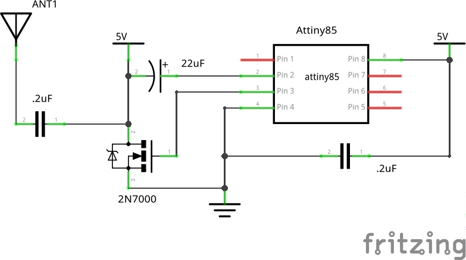
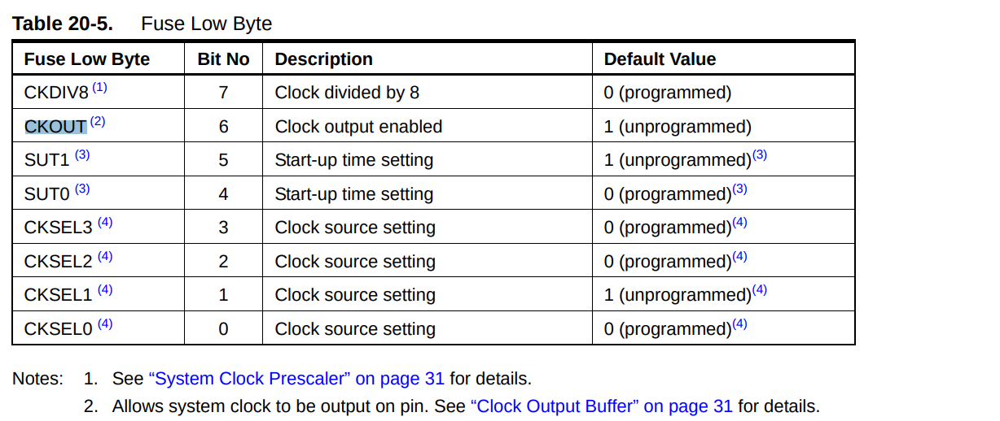

# Attiny85 AM Radio Transmitter

I am still working on it :) The repo will be nice and beautiful when I am done.
Thank you for your patience and support

---

I am adapting the project on this website to ATTINY85:

https://www.swharden.com/wp/2011-08-06-ridiculously-simple-avr-mcu-am-radio-transmitter/

To do so, I need to program the ATTINY85 clkout pin and a regular digital io pin as output. This website was useful in teaching how to use regular arduino C functions to program the ATTINY85.

https://www.hackster.io/arjun/programming-attiny85-with-arduino-uno-afb829

But it does not teach how to configure the clkout pin. So, I found a different way to program the ATTINY85, hoping that it will give me the ability to configure the pins for alternative functions (e.g. clkout) the same way I did for my TM4C123. These websites below are a guide on how to do so.

http://forum.arduino.cc/index.php?topic=335453.0
https://www.instructables.com/id/AVR-Programming-with-Arduino-AVRdude-and-AVR-gcc/

This forum question asking how to send system clock output to a pin might come in handy too.

https://www.avrfreaks.net/forum/sending-system-clock-output

Follow this guide to install avr-gcc and avr-libc.

http://maxembedded.com/2015/06/setting-up-avr-gcc-toolchain-on-linux-and-mac-os-x/

### Preparing the hardware

Scott W Harden came up with the schematic for an AVR AM radio transmitter. 


**TODO: include quotes and explanations from Harden's website**

As there is little difference between the Attiny85 and Attiny44A, there is almost no change to the schematic in our radio transmitter.



The only difference is the pin number for the different functions.

| Pin func | Attiny44A pin no. | Attiny85 pin no. |
|---|---|---|
| Vcc | 1 | 8 |
| Gnd | 4 | 4 |
| CLKO | 5 | 3 |

The "audio" pin is simply a GPIO pin that we set high or low. It does not matter which pin we use as the audio pin. I chose pin 2 (ie PB3) on the Attiny85 as it is beside the CLKO pin.


### Programming the Attiny85

Our Attiny85, like Harden's Attiny44A, serves two purposes:
1. Generate the carrier wave (1MHz in this example)
2. To generate the morse code

##### Generating and outputting the 1MHz wave

Assuming that you've never changed the [fuse bytes] on your Attiny85 before, you need not do anything as the system clock is 1MHz by default.

> The device is shipped with CKSEL = “0010”, SUT = “10”, and CKDIV8 programmed. The default clock source setting is therefore the Internal RC Oscillator running at 8 MHz with longest start-up time and an initial system clock prescaling of 8, resulting in 1.0 MHz system clock.
>  
> *-- Attiny85 datasheet section 6.2.7  - Default Clock Source*
	
To output the 1MHz wave to a pin, we need to program the CKOUT bit in the fuse low byte. We do so by adding the flag `-U lfuse:w:0b00100010:m` to the `avrdude` when we flash the hex. I'll go through that one in more detail later.

 


I programmed the CKOUT bit and tested the output using a cheap (and therefore possibly unreliable) oscilloscope. It registers a wave. I do not know why it states that the period of the wave is 25 microseconds (thereby implying that the frequency is 40kHz). The main point of doing the testing was to make sure that the pin gave a wave as an output, and it did. 


Our Attiny85 would send morse code by setting a GPIO pin high and low for a certain period of time. For instance, to send a `.`, it would send a GPIO high for say 10ms. To send a `_`, it would send a GPIO high for say 50ms. That requires the use of AVR Libc's function [`_delay_ms`](https://www.microchip.com/webdoc/AVRLibcReferenceManual/group__util__delay_1gad22e7a36b80e2f917324dc43a425e9d3.html). It, in turn requires us to define the `F_CPU` macro. 

> #define F_CPU   1000000UL
>  
> CPU frequency in Hz.
>  
> The macro F_CPU specifies the CPU frequency to be considered by the delay macros. This macro is normally supplied by the environment (e.g. from within a project header, or the project's Makefile). The value 1 MHz here is only provided as a "vanilla" fallback if no such user-provided definition could be found.
>  
> *--[AVR-libc util/delay.h](https://www.nongnu.org/avr-libc/user-manual/group__util__delay.html)*

**TODO**

This explains the `PORTB` in the line of code `PORTB|=_BV(3);_delay_ms(1);`.

> PORTx is an 8-bit register which stores the logic values that currently being outputted on the physical pins of Portx if the pins are configured as output pins. So to write values to a port, you write the values to the PORT register of that port.
>  
> *--[AVR tutorials](http://www.avr-tutorials.com/digital/about-avr-8-bit-microcontrollers-digital-io-ports)*


I had trouble changing the fuse bits from inside the C file.
```
#include <avr/io.h>
#define F_CPU 1000000UL

[...]

FUSES=
{
	.low = LFUSE_DEFAULT & FUSE_CKOUT,
	.high = HFUSE_DEFAULT,
	.extended = EFUSE_DEFAULT,
};

```

It is the exact same format that `avr/fuse.h` gives as an example.
```
  135     FUSES = 
  136     {
  137         .low = LFUSE_DEFAULT,
  138         .high = (FUSE_BOOTSZ0 & FUSE_BOOTSZ1 & FUSE_EESAVE & FUSE_SPIEN & FUSE_JTAGEN),
  139         .extended = EFUSE_DEFAULT,
  140     };

*-- Taken from [avr/fuse.h](https://www.nongnu.org/avr-libc/user-manual/fuse_8h_source.html)*
```

But yet I get this error when I try to flash the hex into the attiny.
```
➜  am_radio sudo avrdude -c stk500v1 -p attiny85 -P /dev/ttyACM0 -b 19200 -U flash:w:test.hex

[...]

avrdude: input file test.hex auto detected as Intel Hex
avrdude: ERROR: address 0x820003 out of range at line 19 of test.hex
avrdude: read from file 'test.hex' failed

avrdude: safemode: Fuses OK (E:FF, H:DF, L:E2)
```

I came across [this youtube video at timing 9:30](https://www.youtube.com/watch?v=jP1NTgs-a-s). It recommends using the flag `-U lfuse:w:0bxxxxxxxx:m` with `avrdude` (where `x` is either 1 or 0) to set the fuse. It worked in setting the fuse.

### Flashing the Attiny85

**TODO**

After successful flashing:
```
➜  am_radio avr-gcc -Os -mmcu=attiny85 -c test.c     
In file included from test.c:4:0:
/usr/lib/avr/include/avr/delay.h:36:2: warning: #warning "This file has been moved to <util/delay.h>." [-Wcpp]
 #warning "This file has been moved to <util/delay.h>."
  ^
➜  am_radio avr-objcopy -O ihex test.elf test.hex
➜  am_radio avr-gcc -mmcu=attiny85 -o test.elf test.o
➜  am_radio avr-objcopy -O ihex test.elf test.hex    
➜  am_radio sudo avrdude -c stk500v1 -p attiny85 -P /dev/ttyACM0 -b 19200 -U lfuse:w:0b00100010:m -U flash:w:test.hex
[sudo] password for solomonbstoner: 

avrdude: AVR device initialized and ready to accept instructions

Reading | ################################################## | 100% 0.02s

avrdude: Device signature = 0x1e930b (probably t85)
avrdude: NOTE: "flash" memory has been specified, an erase cycle will be performed
         To disable this feature, specify the -D option.
avrdude: erasing chip
avrdude: reading input file "0b00100010"
avrdude: writing lfuse (1 bytes):

Writing | ################################################## | 100% 0.02s

avrdude: 1 bytes of lfuse written
avrdude: verifying lfuse memory against 0b00100010:
avrdude: load data lfuse data from input file 0b00100010:
avrdude: input file 0b00100010 contains 1 bytes
avrdude: reading on-chip lfuse data:

Reading | ################################################## | 100% 0.01s

avrdude: verifying ...
avrdude: 1 bytes of lfuse verified
avrdude: reading input file "test.hex"
avrdude: input file test.hex auto detected as Intel Hex
avrdude: writing flash (268 bytes):

Writing | ################################################## | 100% 0.45s

avrdude: 268 bytes of flash written
avrdude: verifying flash memory against test.hex:
avrdude: load data flash data from input file test.hex:
avrdude: input file test.hex auto detected as Intel Hex
avrdude: input file test.hex contains 268 bytes
avrdude: reading on-chip flash data:

Reading | ################################################## | 100% 0.22s

avrdude: verifying ...
avrdude: 268 bytes of flash verified

avrdude: safemode: Fuses OK (E:FF, H:DF, L:22)

avrdude done.  Thank you.

➜  am_radio
```
