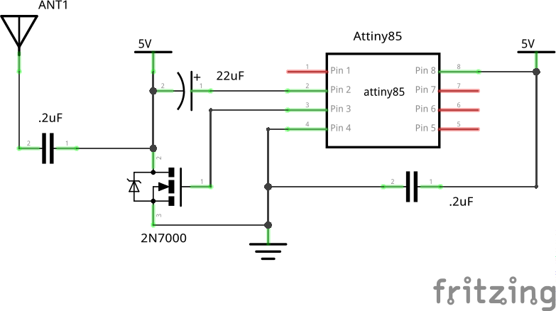
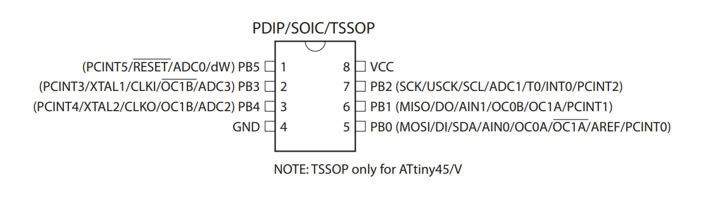
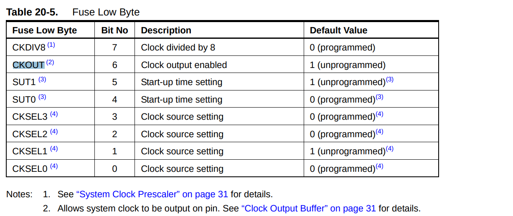
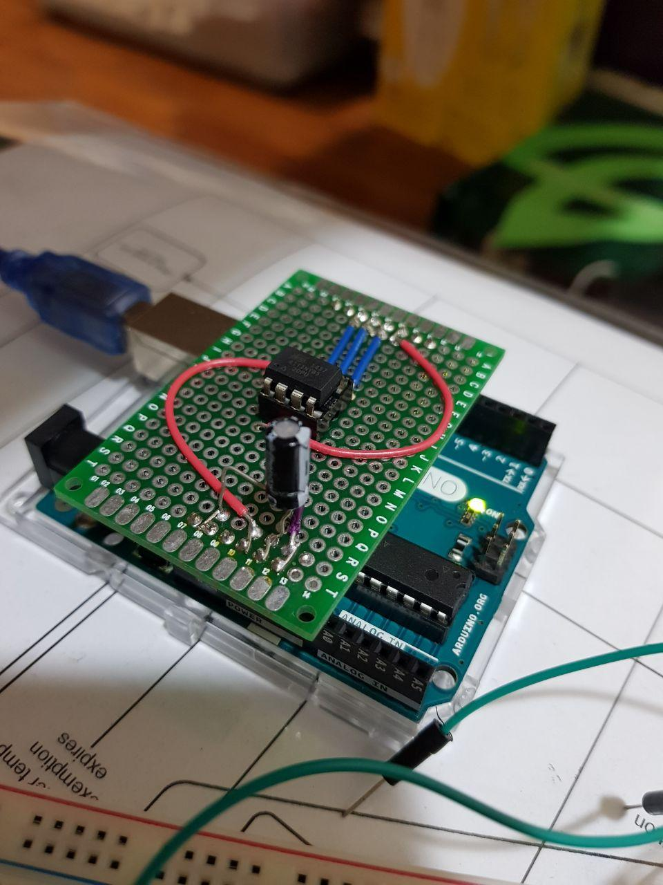

# Attiny85 AM Radio Transmitter

As a beginner in radio looking to make my first AM transmitter at low cost without a kit, I found [this amazing tutorial by Scott Harden](https://www.swharden.com/wp/2011-08-06-ridiculously-simple-avr-mcu-am-radio-transmitter). Its concept is really easy to understand, but I do not have the same microcontroller unit he does. I have the Attiny85 instead. So, I decided to make some minor changes to his project to adapt it to the Attiny85. 


### Preparing the hardware

Scott W Harden came up with the schematic for an AVR AM radio transmitter. 


As there is little difference between the Attiny85 and Attiny44A, there is almost no change to the schematic in the radio transmitter.



The only difference is the pin number for the different functions.

| Pin func | Attiny44A pin no. | Attiny85 pin no. |
|---|---|---|
| Vcc | 1 | 8 |
| Gnd | 4 | 4 |
| CLKO | 5 | 3 |

The "audio" pin is simply a GPIO pin that we set high or low. It does not matter which pin we use as the audio pin. I chose pin 2 (ie PB3) on the Attiny85 as it is beside the CLKO pin.




### Programming the Attiny85

Your Attiny85, like Harden's Attiny44A, serves two purposes:
1. Generate the carrier wave (1MHz in this example)
2. To generate the morse code

##### Generating and outputting the 1MHz wave

Assuming that you've never changed the [fuse bytes](https://embedds.com/all-you-need-to-know-about-avr-fuses/) on your Attiny85 before, you need not do anything as the system clock is 1MHz by default.

> The device is shipped with CKSEL = “0010”, SUT = “10”, and CKDIV8 programmed. The default clock source setting is therefore the Internal RC Oscillator running at 8 MHz with longest start-up time and an initial system clock prescaling of 8, resulting in 1.0 MHz system clock.
>  
> *-- Attiny85 datasheet section 6.2.7  - Default Clock Source*
	
To output the 1MHz wave to a pin, program the CKOUT bit in the fuse low byte by adding the flag `-U lfuse:w:0b00100010:m` to the `avrdude` when you flash the hex. I'll go through the full command in more detail later. You may learn more about fuse bytes from [this youtube video](https://www.youtube.com/watch?v=jP1NTgs-a-s).

 


The Attiny85 sends morse code by setting a GPIO pin high and low for a certain period of time. I'll go through that in more detail later. That requires the use of AVR Libc's function [`_delay_ms`](https://www.microchip.com/webdoc/AVRLibcReferenceManual/group__util__delay_1gad22e7a36b80e2f917324dc43a425e9d3.html). It, in turn, requires us to define the `F_CPU` macro. 

> #define F_CPU   1000000UL
>  
> CPU frequency in Hz.
>  
> The macro F_CPU specifies the CPU frequency to be considered by the delay macros. This macro is normally supplied by the environment (e.g. from within a project header, or the project's Makefile). The value 1 MHz here is only provided as a "vanilla" fallback if no such user-provided definition could be found.
>  
> *--[AVR-libc util/delay.h](https://www.nongnu.org/avr-libc/user-manual/group__util__delay.html)*

Since the clock is running at 1MHz, define F_CPU as `1000000UL` where `UL` means an `unsigned long`.

##### Generating the morse code

Any General Purpose Input Output (GPIO) pin is sufficient to send the morse code. In this example, I'll use pin number `PB3`, which refers to the 3rd pin of Port B.

As you will use `PB3` as an output pin so that you can send signals from the Attiny85 to the outside world, you must inform the Attiny85 to set `PB3` as an output pin. The code, `DDRB|=_BV(3);`, does so.

> DDRx (Data Direction Register) configures data direction of port pins. Means its setting determines whether port pins will be used for input or output. Writing 0 to a bit in DDRx makes corresponding port pin as input, while writing 1 to a bit in DDRx makes corresponding port pin as output.
>  
> --[AVR input output tutorial](http://www.elecrom.com/avr-tutorial-2-avr-input-output/#ddrx_register)


Now that the Attiny85 knows that we will be using `PB3` as an output pin, let's use it to generate some sound. The following code generates a beeping sound at 1kHz for 100ms. That beep is equivalent to a dot in morse code.
```
void beep(){
	for(char i=50;i;i--){
		PORTB|=_BV(3);_delay_ms(1);
		PORTB&=~_BV(3);_delay_ms(1);
	}
}
```

> PORTx is an 8-bit register which stores the logic values that currently being outputted on the physical pins of Portx if the pins are configured as output pins. So to write values to a port, you write the values to the PORT register of that port.
>  
> *--[AVR tutorials](http://www.avr-tutorials.com/digital/about-avr-8-bit-microcontrollers-digital-io-ports)*

The code above makes `PB3` pin high and low by setting and clearing the 3rd bit in the PORTB register respectively.

A dash in morse code is simply a beep that lasts longer. In this case it lasts for 300ms. The `rest` function is a break in sending the morse code so that a sequence of dots and dashes is not confused with another.

```
void rest(){_delay_ms(100);}
void dot(){beep();rest();}
void dash(){beep();beep();beep();rest();}
```

##### Summary of the code

This is the code that we will flash into the Attiny85. 

```
#include <avr/io.h>
#define F_CPU 1000000UL
#include <avr/delay.h>
#include <avr/interrupt.h>

void beep(){
	for(char i=50;i;i--){
		PORTB|=_BV(3);_delay_ms(1);
		PORTB&=~_BV(3);_delay_ms(1);
	}
}

void rest(){_delay_ms(100);}

void dot(){beep();rest();}
void dash(){beep();beep();beep();rest();}
void space(){rest();rest();}
void space2(){space();space();}


int main(){
	DDRB|=_BV(3);
	for(;;){
		dot();dot();dot();space(); 			// S
		dash();dot();dash();dot();space(); 	// C
		dash();dash();dash();space(); 		// O
		dash();space(); 					// T
		dash();space(); 					// T
		space2();
		dot();dash();dot();space();			// R
		dash();dash();dash();space(); 		// O
		dash();dot();dash();dot();space(); 	// C
		dash();dot();dash();space();		// K
		dot();dot();dot();space(); 			// S
		_delay_ms(1000); // silence
	}
	return 0;
}
```

### Flashing the Attiny85

We will be flashing the Attiny85 using an Arduino Uno as the ISP. Set it up as shown in the picture below.


You may even choose to make a shield for the Attiny85. I did that.



In order to compile the C code, make sure you have the avr-gcc-toolchain installed by following the guide in [this website](http://maxembedded.com/2015/06/setting-up-avr-gcc-toolchain-on-linux-and-mac-os-x/).

After installing the dependencies, run the following commands in sequence from top to bottom to compile and flash the code into the Attiny85. Replace `test.c` with the name of your C file. The Arduino you plug in may not be located at `/dev/ttyACM0`. It could also be located at `/dev/ttyACM1`. Run `dmesg|tail` after you plug in the Arduino, which you will use to program the Attiny85, to the computer.

```
avr-gcc -Os -mmcu=attiny85 -c test.c 
avr-gcc -mmcu=attiny85 -o test.elf test.o
avr-objcopy -O ihex test.elf test.hex
sudo avrdude -c stk500v1 -p attiny85 -P /dev/ttyACM0 -b 19200 -U lfuse:w:0b00100010:m -U flash:w:test.hex
```


This is the ouput from successful compilation and flashing of the Attiny85. The last line, `avrdude: safemode: Fuses OK (E:FF, H:DF, L:22)`, shows that the `ckout` bit has been successfully set.

```
➜  am_radio avr-gcc -Os -mmcu=attiny85 -c test.c     
In file included from test.c:4:0:
/usr/lib/avr/include/avr/delay.h:36:2: warning: #warning "This file has been moved to <util/delay.h>." [-Wcpp]
 #warning "This file has been moved to <util/delay.h>."
  ^
➜  am_radio avr-objcopy -O ihex test.elf test.hex
➜  am_radio avr-gcc -mmcu=attiny85 -o test.elf test.o
➜  am_radio avr-objcopy -O ihex test.elf test.hex    
➜  am_radio sudo avrdude -c stk500v1 -p attiny85 -P /dev/ttyACM0 -b 19200 -U lfuse:w:0b00100010:m -U flash:w:test.hex
[sudo] password for solomonbstoner: 

avrdude: AVR device initialized and ready to accept instructions

Reading | ################################################## | 100% 0.02s

avrdude: Device signature = 0x1e930b (probably t85)
avrdude: NOTE: "flash" memory has been specified, an erase cycle will be performed
         To disable this feature, specify the -D option.
avrdude: erasing chip
avrdude: reading input file "0b00100010"
avrdude: writing lfuse (1 bytes):

Writing | ################################################## | 100% 0.02s

avrdude: 1 bytes of lfuse written
avrdude: verifying lfuse memory against 0b00100010:
avrdude: load data lfuse data from input file 0b00100010:
avrdude: input file 0b00100010 contains 1 bytes
avrdude: reading on-chip lfuse data:

Reading | ################################################## | 100% 0.01s

avrdude: verifying ...
avrdude: 1 bytes of lfuse verified
avrdude: reading input file "test.hex"
avrdude: input file test.hex auto detected as Intel Hex
avrdude: writing flash (268 bytes):

Writing | ################################################## | 100% 0.45s

avrdude: 268 bytes of flash written
avrdude: verifying flash memory against test.hex:
avrdude: load data flash data from input file test.hex:
avrdude: input file test.hex auto detected as Intel Hex
avrdude: input file test.hex contains 268 bytes
avrdude: reading on-chip flash data:

Reading | ################################################## | 100% 0.22s

avrdude: verifying ...
avrdude: 268 bytes of flash verified

avrdude: safemode: Fuses OK (E:FF, H:DF, L:22)

avrdude done.  Thank you.

➜  am_radio
```

Power up your AM transmitter and a AM receiver, and start receiving your broadcast at a very limited range. The range of my transmitter was less than 1 metre. Here's [a video](pics_and_videos/working_attiny85_radio_video.mp4) of my AM transmitter .
